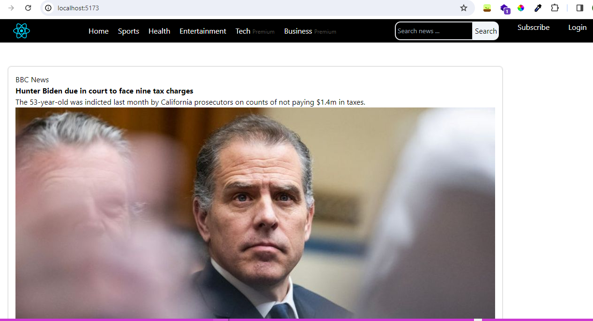
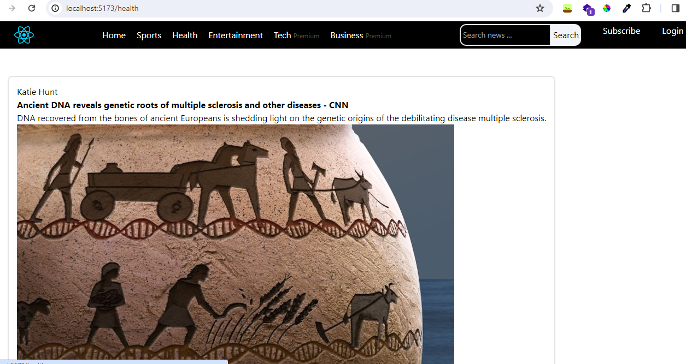
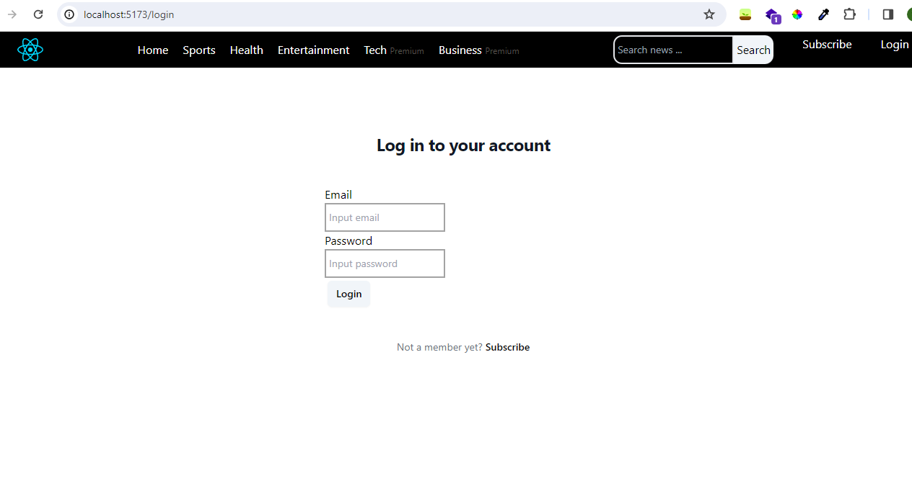

# React News Web App with API from newsapi.org   

## Component  

- Public page  
Accessible by public, no authorization needed  
  - Home page  

    

  - Public news category  (Sports, Health, Entertainment)  
    

- Private page  
Authorization needed, users need to make subscription and login to gain access to contents     
  - Premium news category (Tech and Business)    
    

## Library and dependencies  

- Node js and NPM  
- React js  
- Vite  
- Formik  
- Yup  
- Tailwind  
- Axios  

## API  
This web app is created with an API call from newsapi.org  
- API Documentation : https://newsapi.org/docs/  
- Plan : free plan/developer plan (https://newsapi.org/pricing)  

## Deployment  

This project cannot be deployed since free plan is only available for use on development (localhost) only  

But here's a video tour instead:  
https://www.loom.com/share/e1261bcfa782476298288b440bd53abc  

Thanks for reading ~^-^~